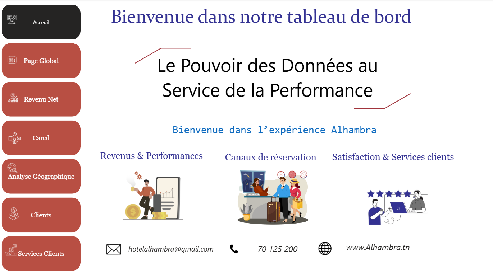
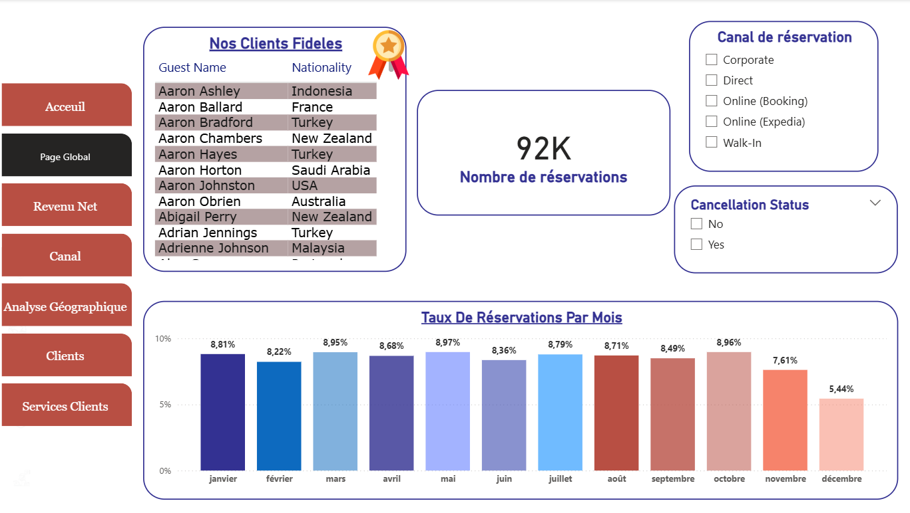
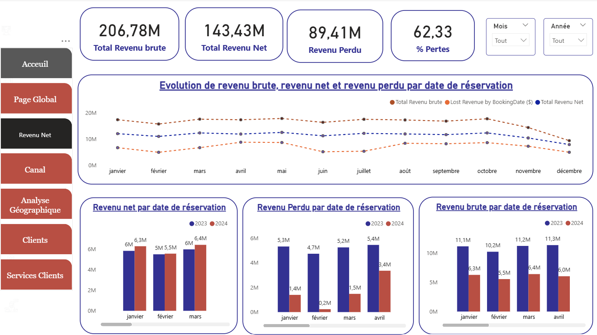
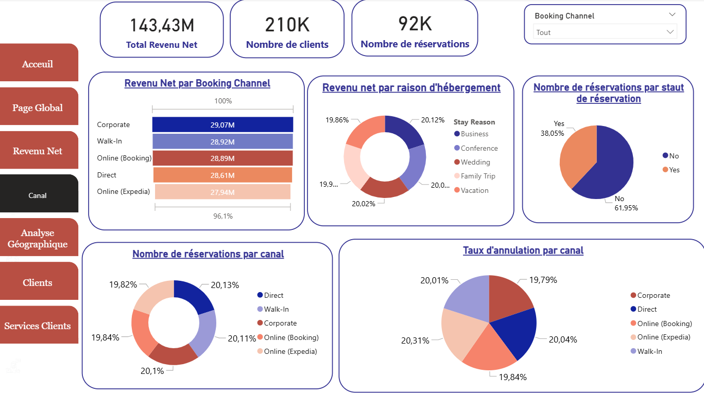
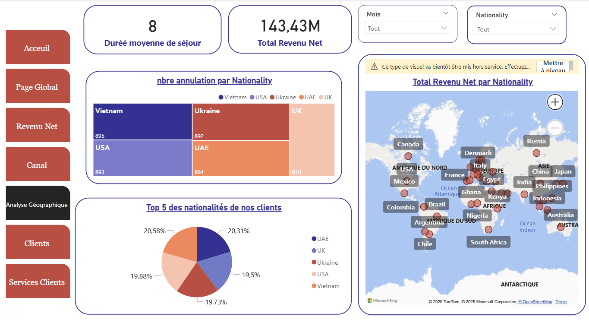
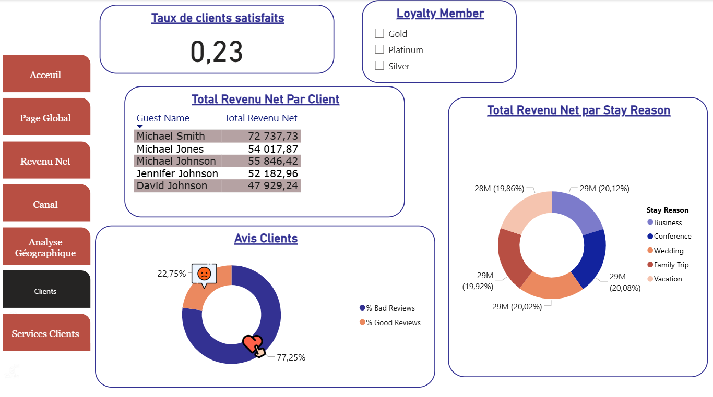
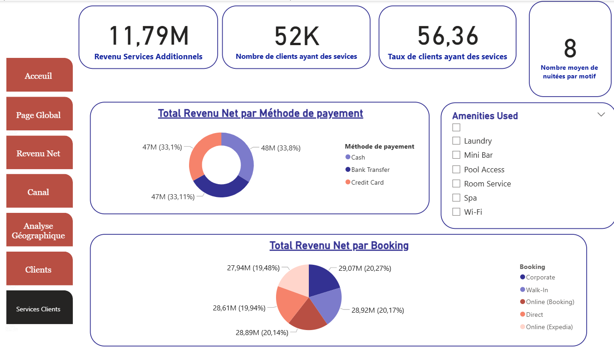

# 🏨 Hotel Revenue & Performance Analysis – Power BI Project

## 🎯 Project Objective
This project aims to analyze hotel performance data in order to improve revenue management, understand customer behavior, and optimize booking strategies using interactive dashboards and data analytics techniques.

---

## 📊 Dashboard Overview

### Home Page

---
### Global Dashboard Overview

---

### 💰 Net Revenue Analysis
Analysis of revenue performance, trends, and key financial KPIs.

---

### 📅 Booking Channel Analysis
Evaluation of booking sources and their impact on overall performance.

---

### 🌍 Geographical Analysis
Study of customer distribution and performance across different regions.

---

### 👥 Customer Analysis
Understanding customer behavior, segmentation, and booking patterns.

---

### 🧾 Customer Services Analysis
Evaluation of service usage and customer satisfaction-related indicators.

---

## 🧠 Key Insights
- Revenue varies significantly depending on booking channels
- Certain regions contribute more to high-value bookings
- Customer segmentation helps identify profitable user groups
- Service usage patterns influence customer satisfaction and retention

---

## 🛠️ Tools & Technologies
- Power BI (DAX, Power Query)
- Excel (Data preparation)
- Data visualization & dashboard design
- Basic statistical analysis

---

## 📌 Project Highlights
- Interactive dashboards for business decision-making
- Clean and structured data modeling
- KPI tracking (Revenue, Occupancy, Booking trends)
- Business-oriented insights for hotel performance optimization

---

